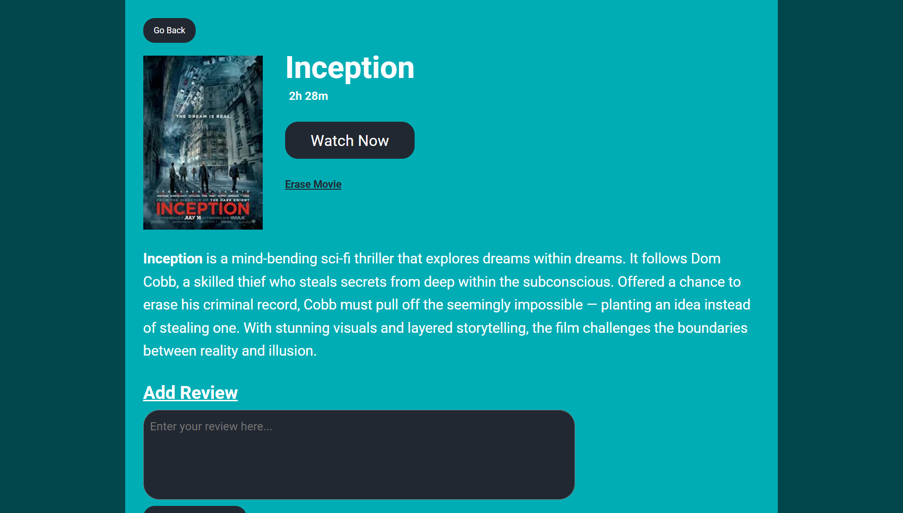

# 🎬 Cinema Tracker

Cinema Tracker is a simple movie management app. You can **add movies to your watchlist, delete them, and mark the ones you’ve already watched**. It helps you organize what to watch and what you’ve finished.

## ✨ Features
- Add movies to your list
- Delete movies from the list
- Mark movies as watched / unwatched
- View your watchlist

## 🛠 Tech Stack
- React (frontend)
- (Optional) Node / Express (backend)
- (Optional) Any database (e.g., MongoDB, PostgreSQL)

## 🖼 Screenshot


## 🚀 Installation
```bash
# clone repo
git clone https://github.com/yourusername/your-repo.git
cd your-repo

# install dependencies
npm install

# start dev server
npm start
